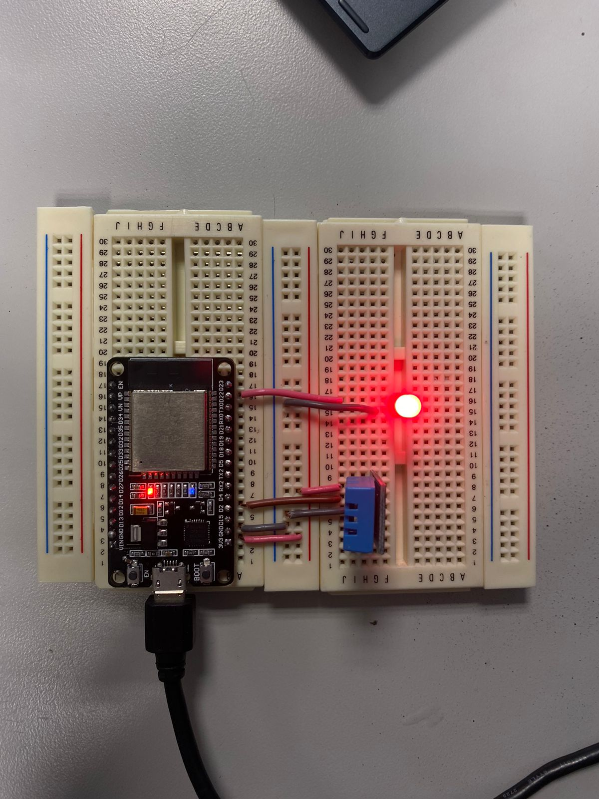

# Gnoberto: Sistema de Monitoreo de Plantas basado en IoT

  

Gnoberto es un proyecto innovador desarrollado como parte de la materia de Implementación de Internet de las Cosas. Este sistema de monitoreo de plantas utiliza la tecnología IoT para proporcionar un cuidado avanzado y eficiente a tus plantas, incorporando un enfoque lúdico y educativo.

## Características Principales
ESP32 Sensorizado: El corazón de Gnoberto es un microcontrolador ESP32 que integra un sensor de temperatura y humedad (DHT11), un botón de control y un LED indicador.

### Prototipo Circuito

  

Conectividad a la Nube: Gnoberto se conecta a una base de datos MySQL a través de una interfaz web, permitiendo la recopilación y visualización en tiempo real de datos cruciales para el crecimiento de las plantas.

Interfaz Web Intuitiva: Una interfaz web diseñada de manera amigable proporciona a los usuarios acceso fácil a información esencial, como la temperatura y humedad del entorno de la planta.

### Página Web

  

Notificaciones LED: Gnoberto alerta a los usuarios sobre condiciones ambientales inadecuadas mediante un LED indicador, brindando una retroalimentación visual instantánea.

## Configuración y Uso
Configuración del ESP32: Carga el código proporcionado en el ESP32 para habilitar la conexión con la base de datos y la captura de datos del entorno.

Base de Datos en Tiempo Real: Utilizando MySQL, Gnoberto almacena los datos capturados por el ESP32 en una base de datos, permitiendo un acceso rápido y eficiente.

Interfaz Web Intuitiva: Accede a la interfaz web desde cualquier dispositivo para monitorizar en tiempo real la temperatura y humedad de tus plantas. La interfaz también notifica sobre condiciones críticas a través de un sistema de alerta visual.
